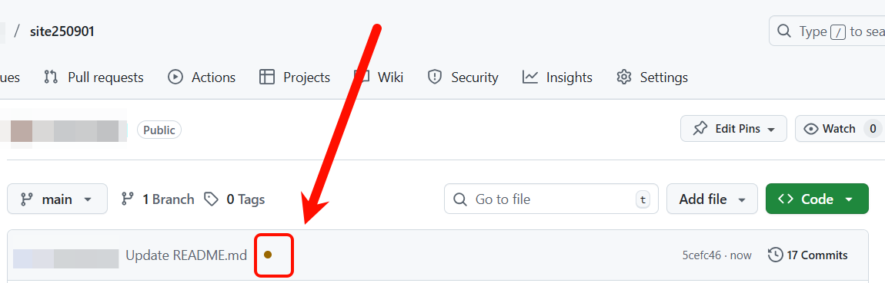
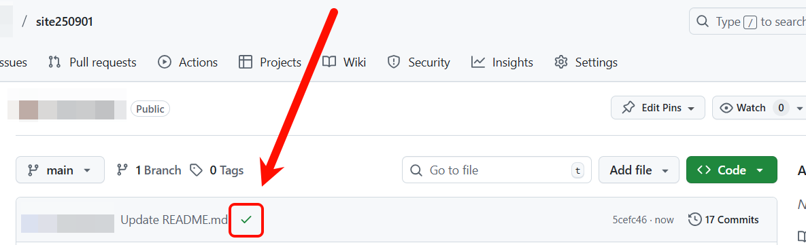

# 主页更新

## 必要修改

###  `_config.yml`

根目录下的 `_config.yml` 对应网页的左侧栏内容，仅对以下内容进行修改即可：

  ```yaml
# Basic Information # 基本信息，必须修改
title: 姓名
position: 当前职位
affiliation: 所在单位
email: 邮箱

# Links # 链接，会以图标的形式显示在基本信息的下方，如果没有相应的连接，直接注释掉或者删除即可
# If you don't need one of them, you may delete the corresponding line or just comment it.
#google_scholar: https://scholar.google.com/
#cv_link: files/Curriculum_Vitae.pdf # 需要将 CV 放置在 `assets/files/Curriculum_Vitae.pdf`
#github_link: https://github.com/
#linkedin: https://www.linkedin.com/
#twitter: https://twitter.com/

# Images (e.g., your profile picture and your website's favicon) # 图片路径
# "favicon" and "favicon_dark" are used for the light and dark modes, respectively. 
avatar: ./assets/img/avatar.png   # 左侧栏位置的个人照片，必须修改
favicon: ./assets/img/favicon.png  # 网站图标，保持默认即可
favicon_dark: ./assets/img/favicon-dark.png  # 黑暗模式下的网站图标，保持默认即可
  ```

### `index.md`

根目录下的 `index.md`  对应网页的右侧栏内容，遵循 [Markdown](https://www.markdownguide.org/basic-syntax/) 的基本语法进行修改、添加、删除即可。

注意，文件顶部这三行内容不要删除，也不要做修改：

  ```yaml
---
layout: homepage
---
  ```

---

## 非必要修改

修改上述内容已经足够了，如果想进一步修改页面布局、细节样式等，可以直接修改以下文件：

`/_layouts/homepage.html`

`/_sass/minimal-light.scss`

`/_sass/minimal-light-no-dark-mode.scss`

`/assets/css/...`

# 提交更新以后

提交更新后，在仓库中对应图 1 箭头所示的位置会出现一个棕色圆点。大约等待 1–2 分钟后，该圆点会变为图 2 中的绿色对号，表示主页已更新完成。此时再次打开主页即可查看最新内容。


图1


图2